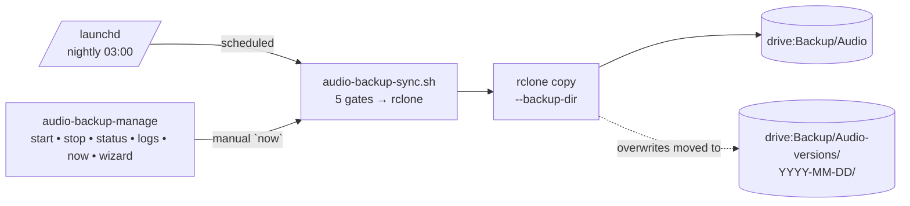
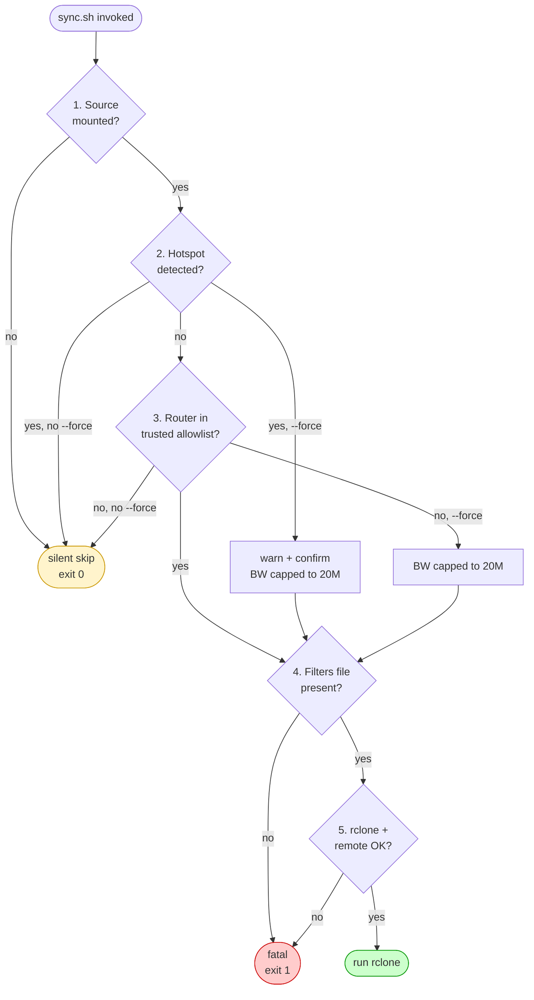

# Audio Backup

Automated, network-gated backup of the `/Volumes/Audio/Audio` working drive to Google Drive via `rclone`, scheduled by `launchd`.

Replaces the previous yearly manual backup ritual. Once configured, it runs nightly on its own when conditions are right (drive mounted + on a trusted Wi-Fi network) and stays silent otherwise.

---

## Files

All four live in `~/dotfiles/scripts/`:

| File | Role |
|---|---|
| `audio-backup.conf` | Single source of truth — source path, remote, trusted-router allowlist, schedule, bandwidth caps, log location |
| `audio-backup-filters.txt` | rclone include/exclude rules (what's in scope, what's skipped) |
| `audio-backup-sync.sh` | The one-shot sync action. Runs all gates, then invokes rclone. Idempotent. |
| `audio-backup-manage.sh` | Service controller — `start`/`stop`/`status`/`logs`/`now`/`wizard` |

The launchd plist (`~/Library/LaunchAgents/com.jeromefaria.audiobackup.plist`) is generated by `wizard --setup` from the schedule values in the config.

---

## Architecture



**Five gates** in `audio-backup-sync.sh`. If any non-fatal gate fails, the script exits 0 cleanly (launchd treats as no-op):



1. **Source mounted** — sentinel file (`/Volumes/Audio/Audio/SYSTEM.md`) must exist. Drive ejected → silent skip.
2. **Hotspot check** — Wi-Fi router matching `172.20.10.*` is iPhone Personal Hotspot. Detected → silent skip (unless `--force`, which warns).
3. **Trusted-router allowlist** — current Wi-Fi router IP must be in `TRUSTED_ROUTER_ALLOWLIST`. Not allowlisted (or not on Wi-Fi at all) → silent skip (unless `--force`).
4. **Filters file present** — fatal error if missing.
5. **rclone installed + remote configured** — fatal error if either is missing.

### How network identification works (macOS Tahoe / 14.4+)

Network identity is established **via the Wi-Fi service's router IP**, not the SSID. This is a deliberate workaround for a macOS privacy lockdown.

**What macOS does on Tahoe (26.x) and any Sonoma 14.4+:** the OS redacts the SSID and BSSID at the API layer for any binary without a Location Services entitlement. Every user-space surface is affected:

- `networksetup -getairportnetwork en0` → returns the literal string `You are not associated with an AirPort network.` even when fully connected
- `ipconfig getsummary en0` → returns `SSID : <redacted>` and `BSSID : <redacted>` as literal four-character strings
- `system_profiler SPAirPortDataType` → returns `Current Network Information:` followed by `<redacted>:`
- `wdutil info` → only works under `sudo`, not viable for unattended launchd jobs

**What still works without any permission grant:** `networksetup -getinfo Wi-Fi` exposes the **Wi-Fi service's DHCP router IP**. This is what the scripts use. Trade-offs versus SSID:

- ✓ No Location Services permission grant required, no UI dance, no per-binary permission drift across macOS upgrades.
- ✓ A single router IP entry covers both the 5 GHz and 2.4 GHz SSIDs of the same home router (they share the gateway).
- ✓ **VPN-immune.** The system default gateway (`route -n get default`) gets hijacked by an active VPN tunnel — the Wi-Fi service's router IP does not.
- ⚠ Less granular than SSID. The script trusts any network where the router IP matches — a coffee-shop AP that issued DHCP from `192.168.1.0/24` with `192.168.1.254` as gateway would pass the gate. Vanishingly unlikely in practice (someone would have to deliberately reconfigure their AP to mimic your home subnet), and even then the worst case is a backup transfer that wasn't supposed to happen — not a data leak.

If stricter identity matters down the line, the router **MAC address** (`arp -n <router-ip>`) is also exposed without permission and can be added as a secondary check.

---

## Quickstart

```bash
# 1. Install rclone
brew install rclone

# 2. Read your home/studio Wi-Fi router IP
networksetup -getinfo Wi-Fi | awk -F': ' '/^Router:/{print $2}'

# 3. Drop that IP into the conf
$EDITOR ~/dotfiles/scripts/audio-backup.conf
# Replace the REPLACE-WITH-ROUTER-IP placeholder in TRUSTED_ROUTER_ALLOWLIST.

# 4. Run the setup wizard
~/dotfiles/scripts/audio-backup-manage.sh wizard --setup
```

The wizard walks through:

- rclone install check
- `rclone config` for the Google Drive OAuth remote (interactive browser)
- Current Wi-Fi router detection vs allowlist (warns if drift)
- Filter file presence
- Log directory creation
- Optional dry-run preview
- Plist generation + `launchctl load` to enable the nightly schedule

---

## Daily usage

```bash
audio-backup-manage status              # show service state + last sync
audio-backup-manage logs                # tail recent sync log + launchd stderr
audio-backup-manage now --dry-run       # preview what would transfer (no writes)
audio-backup-manage now                 # manual run, respects all gates
audio-backup-manage now --force         # bypass router allowlist; warns interactively on hotspot
audio-backup-manage now --force --yes   # bypass + skip the hotspot warn (data $$$)
audio-backup-manage wizard              # interactive: pre-flight, dry-run, confirm, sync
audio-backup-manage stop                # disable nightly schedule
audio-backup-manage start               # re-enable
audio-backup-manage restart             # reload (after config edit affecting plist)
```

**After editing `audio-backup.conf`:**

- Source/allowlist/filter/bandwidth changes → take effect on the next sync; no reload needed.
- `SCHEDULE_HOUR` / `SCHEDULE_MINUTE` / `LAUNCHD_LABEL` changes → re-run `wizard --setup` to regenerate the plist, then `restart`.

---

## What's in scope (filters)

See `audio-backup-filters.txt`. Rules are evaluated top-to-bottom, first match wins.

**Included (current scope):**

- `SYSTEM.md` — reorg ledger at drive root
- `Documents/**`
- `Releases/**`
- `Recordings/**`
- `Projects/**`

**Excluded:**

- Live regeneratable artefacts inside any project — `Analysis Files/`, `Autosaves/`, `Backup/`, `Undo/`, `Freeze/`
- Loose `*.asd` analysis cache files anywhere
- macOS clutter — `.DS_Store`, `Icon\r`, `._*`, `.Trashes/`, `.Spotlight-V100/`, `.fseventsd/`
- `Libraries/`, `Samples/` — out of scope per the backup design (vendor-redownloadable, large, low value). Reconsider if `Samples/Originals/` lands with own recordings worth preserving.

**To preview the actual scope before any transfer:**

```bash
rclone copy /Volumes/Audio/Audio drive:Backup/Audio \
  --filter-from ~/dotfiles/scripts/audio-backup-filters.txt --dry-run
```

---

## Network behaviour

**On a trusted Wi-Fi router (in `TRUSTED_ROUTER_ALLOWLIST`):** runs at full `BWLIMIT_DEFAULT` (100M).

**On an untrusted router:** automatic schedule skips silently. `--force` runs at the throttled `BWLIMIT_FORCE` (20M).

**On iPhone hotspot (router `172.20.10.*`):** automatic schedule skips silently. `--force` shows an interactive warning + confirmation prompt before running at `BWLIMIT_FORCE`. `--force --yes` skips the warning but still throttles.

**On Ethernet (no Wi-Fi router):** automatic schedule skips silently (the router field is empty, so no allowlist match). Use `--force` to run anyway.

**Drives not mounted:** silent skip — launchd sees a clean no-op, not a failure.

Override the cap for any run:

```bash
audio-backup-manage now --bwlimit 50M
```

---

## Versioning + recovery

`rclone copy --backup-dir` is configured (not `sync`), which means:

- **Files added locally** → uploaded to `drive:Backup/Audio/`
- **Files modified locally** → new version uploaded; the **previous Drive version** is moved to `drive:Backup/Audio-versions/YYYY-MM-DD/<same-path>`
- **Files deleted locally** → the Drive copy **stays** in `drive:Backup/Audio/` (additive-only behaviour). It is _not_ moved to versions.

**To restore a single file as it was on a given date:**

```bash
rclone copy drive:Backup/Audio-versions/2026-06-17/Projects/SomeProject.als \
            /Volumes/Audio/Audio/Projects/SomeProject.als
```

**To restore the whole drive from the latest backup:**

```bash
rclone copy drive:Backup/Audio /Volumes/Audio/Audio --progress
```

**Pruning old versions** (the `Audio-versions/` tree grows monotonically):

```bash
# List version dates
rclone lsd drive:Backup/Audio-versions

# Remove versions older than 90 days (example)
rclone delete drive:Backup/Audio-versions --min-age 90d
rclone rmdirs drive:Backup/Audio-versions --leave-root
```

---

## Schedule (launchd)

Generated from `audio-backup.conf` by `wizard --setup`. Defaults to **daily at 03:00**.

**Plist location:** `~/Library/LaunchAgents/com.jeromefaria.audiobackup.plist`

**Inspect:**

```bash
launchctl list | grep audiobackup
plutil -p ~/Library/LaunchAgents/com.jeromefaria.audiobackup.plist
```

**Trigger a fake "now" through launchd** (rare; just use `audio-backup-manage now`):

```bash
launchctl start com.jeromefaria.audiobackup
```

**launchd logs:** the `StandardOutPath` / `StandardErrorPath` go to `${LOG_DIR}/launchd.out.log` and `${LOG_DIR}/launchd.err.log`. Per-run sync logs are separate (`audio-backup-YYYY-MM-DD.log`).

---

## Common scenarios

**Travelling without home Wi-Fi**
— Schedule keeps firing nightly but each run silently no-ops (untrusted router or not on Wi-Fi). No data burned, no log spam beyond a one-line skip notice.

**Need to sync from a coffee shop**
— `audio-backup-manage now --force` runs, throttled to 20M.

**Tethered to iPhone for half an hour**
— `audio-backup-manage now --force --yes` if you accept the data hit, or just wait until you're back on home WiFi.

**Audio drive ejected when 03:00 hits**
— Silent skip, no error. Next mounted+trusted-router night picks up where the missing files left off.

**Drive remote path moves** (e.g. `Backup/Audio` → `Backups/Audio-2026`)
— Edit `RCLONE_DEST_PATH` in `audio-backup.conf`. Next run goes to the new path. Old path stays in Drive until manually moved/deleted.

**Adding a new trusted network** (e.g. another studio, family home)
— Read its router IP from `networksetup -getinfo Wi-Fi | awk -F': ' '/^Router:/{print $2}'` while connected, then append to `TRUSTED_ROUTER_ALLOWLIST` in `audio-backup.conf`. No reload needed.

**New ISP / new router with a different gateway IP**
— Update the entry in `TRUSTED_ROUTER_ALLOWLIST`. Five-second edit.

**Switching to a true mirror (deletions propagate)** — Not recommended for archival, but possible: in `audio-backup-sync.sh`, change `copy` to `sync` in the `RCLONE_ARGS` array. Local deletions will then move the Drive copy to the dated versions tree. Re-read the design rationale below first.

---

## Troubleshooting

**"rclone remote 'drive:' not configured"**
— Run `rclone config` and create a remote named `drive` (or change `RCLONE_REMOTE` in the conf to match an existing remote name). The setup wizard walks through this.

**"Router 'x.x.x.x' not in trusted allowlist"**
— Expected when not on a configured network. Read the actual router:

```bash
networksetup -getinfo Wi-Fi | awk -F': ' '/^Router:/{print $2}'
```

…then add it to `TRUSTED_ROUTER_ALLOWLIST` in `audio-backup.conf`.

**"Router '<none>' not in trusted allowlist" — but I have internet**
— You're on Ethernet, or Wi-Fi is off, or the Wi-Fi service has no DHCP lease (e.g. captive portal stuck). The router-IP gate has no value to match against. Use `--force` to override.

**"All my SSIDs look like `<redacted>` when I check"**
— That's macOS Tahoe / Sonoma 14.4+ redacting the SSID surface at the API level. Not a bug, not fixable from userspace without a Location Services entitlement. The scripts use router IP precisely because of this — you do not need the SSID for the gate to work.

**Service shows loaded but no recent sync log**
— The script is exiting on a gate before reaching rclone. Run `audio-backup-manage logs` for the per-run logfile and `audio-backup-manage now --dry-run` from a TTY for verbose output.

**rclone exits non-zero**
— Per-run log records the exit code. Common causes: token expired (re-run `rclone config reconnect drive:`), Drive quota exceeded, network drop mid-transfer (idempotent — re-run resumes).

**`launchctl list` doesn't show the label after `start`**
— Plist file is malformed or missing. Re-run `audio-backup-manage wizard --setup` to regenerate.

**Wrong colour output in launchd logs** (shouldn't happen)
— The script auto-detects TTY (`[ -t 1 ]`) and disables colour when redirected. If raw ANSI codes appear in `launchd.out.log`, the detection failed — file a bug to self.

---

## Design rationale

**Why `rclone` and not Drive Stream / Backup & Sync?**
Drive Stream re-syncs deleted files back from the cloud on next start. It also tries to sync everything by default, which is the opposite of what's wanted for a curated archival backup. `rclone` is explicit, scriptable, and won't fight with whatever Drive client UI Apple/Google ship next year.

**Why `copy --backup-dir` and not `sync`?**
Archival intent. A local accidental delete shouldn't propagate to Drive. The versions tree captures overwrites for rollback. Cost: monotonic growth that needs periodic pruning (`rclone delete --min-age`). Acceptable for the scope.

**Why launchd and not cron?**
cron is deprecated on modern macOS. launchd handles missed schedules (drive ejected, laptop asleep) by running on next wake automatically.

**Why a sentinel-file mount check?**
`mount | grep /Volumes/Audio` is fragile; APFS mount names drift. A known file at the source root is unambiguous.

**Why router IP and not SSID for the trusted-network gate?**
macOS Sonoma 14.4 (and confirmed on Tahoe 26.x) locked the SSID surface behind Location Services. Every user-space API — `networksetup -getairportnetwork`, `ipconfig getsummary`, `system_profiler SPAirPortDataType`, even the `airport` tool — either returns a bogus string or the literal four-character placeholder `<redacted>` without that entitlement. Granting it requires per-binary UI toggling that drifts across macOS upgrades and is awkward to wire up for launchd-invoked jobs.

`networksetup -getinfo Wi-Fi` exposes the **Wi-Fi service's DHCP router** with no permission required. The router IP is a perfectly adequate identifier for "is this my home/studio network or not" — a single router serves both 2.4 GHz and 5 GHz SSIDs, and the gateway IP is the same property the hotspot check already uses. One mechanism, no permission grant, VPN-immune (the system default gateway is hijacked by an active tunnel; the Wi-Fi service router is not).

**Why an allowlist gate at all and not "any Wi-Fi"?**
Hotspot data burn. A single un-throttled run on a metered iPhone connection can blow a monthly cap. The allowlist makes the trusted-network claim explicit.

**Why per-run logfiles by date?**
Easier to inspect a specific day's run; easier to prune (`find -mtime +90 -delete`).

**Why bash and not Python?**
Mirrors the existing `mail/scripts/sync-mail.sh` + `manage-sync.sh` pattern in this dotfiles repo. Same shape, same idioms, lower cognitive overhead when switching between the two. No dependency beyond `rclone` itself.

**Why two scripts (sync + manage)?**
Separation of concerns. `sync.sh` is the action — composable, callable from anywhere, takes flags. `manage.sh` is the human-facing service controller — handles launchd lifecycle, wizard, log viewing. launchd calls `sync.sh` directly without going through `manage.sh`, so there's no extra process layer on the scheduled path.

---

## Related

- `~/dotfiles/mail/scripts/sync-mail.sh` + `manage-sync.sh` — the pattern this is modelled on
- `/Volumes/Audio/Audio/SYSTEM.md` — the drive reorganisation ledger; also serves as the mount sentinel
- `/Volumes/Audio/Audio/Documents/.backup-logs/` — per-run logs land here (excluded from the backup itself via filter)
